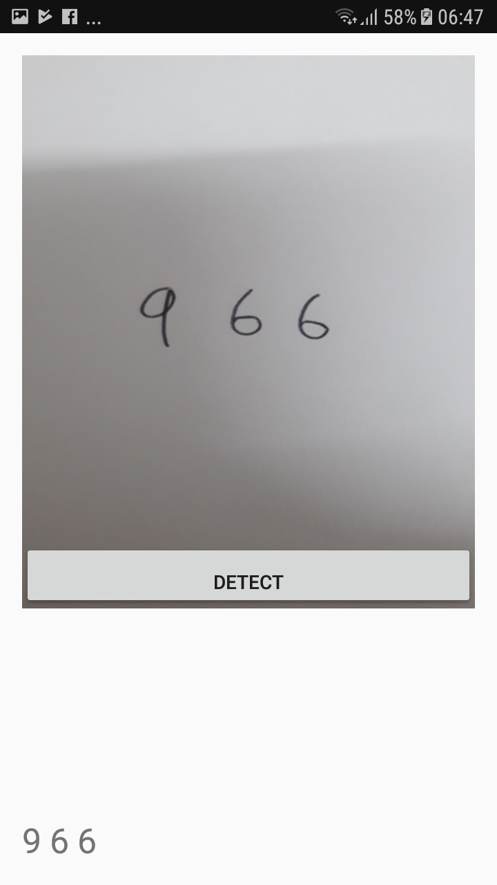

## Handwritten digit recognition

### What it is?
It enables you to snap picture of digits and display out the number (not very useful thou). The main purpose of this apps is to develop a handwritten digit recognitio algorithm. [This repo](https://github.com/tensorflow/tensorflow/tree/master/tensorflow/examples/android) help guided me. This application convert the image to [binary image](https://en.wikipedia.org/wiki/Binary_image) and a feature extraction algorithm is applied to obtain the black pixel of the image (the digit). The inspiration behind the feature extraction algorithm is somewhat similar to the detection [connected component](https://www.youtube.com/watch?v=ticZclUYy88). Lastly, a trained CNN model (protobuf) is used to classify what number is the presented feature from the previous steps.

### Sample Result 

## Motive
This project is to automate manual data entry labour at data entry companies. For example we could automate the manual labor of keying in bank cheques into database and greatly reduce errors.

The important codebase is in the file [MainActivity.java](https://github.com/moon004/Handwritten-Recognition-AI-Method/blob/master/jobs/mnistandroid/MainActivity.java) and [Processing.java](https://github.com/moon004/Handwritten-Recognition-AI-Method/blob/master/jobs/mnistandroid/Processing.java).